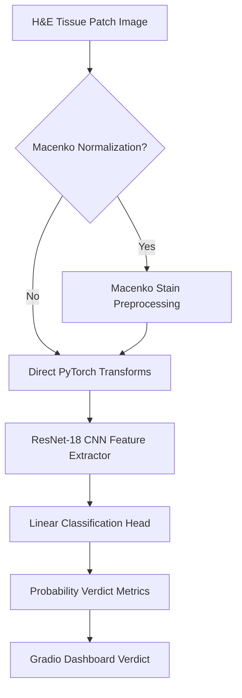

# 🔬 CAD-Pathology Assistant: Histopathology Tumour Classification

This repository houses a modular, deep learning-powered pipeline for the automated classification and screening of metastatic cancer in histopathology slides, built using PyTorch and Gradio. The project focuses on detecting metastatic breast cancer cells in lymph node patches from the **PatchCamelyon (PCam)** benchmark dataset.

---

## 🌟 Key Features

1. **Macenko Stain Normalization**: Color consistency preprocessing to counter scanner and stain variations across H&E slide inputs.
2. **ResNet-18 Transfer Learning**: Pretrained ImageNet CNN fine-tuned for high-accuracy binary classification (Healthy vs. Metastatic Tumour).
3. **Interactive Pathology Dashboard**: A premium Gradio interface featuring custom HTML verdict displays, glowing probability progress bars, and clickable clinical samples.
4. **Flexible Mock/Real Execution Modes**: Out-of-the-box support for mock dataset generation allowing verification of training, evaluation, and dashboard code without downloading the large Zenodo datasets.

---

## 📐 Architecture & Pipeline



### 🧬 Macenko Stain Normalization
Histological slide images suffer from color variations due to differences in staining protocols, scanner configurations, and slide ages. The Macenko method:
1. Converts the RGB input space into **Optical Density (OD)** values.
2. Identifies and filters out non-tissue/transparent pixels.
3. Performs **Singular Value Decomposition (SVD)** to extract staining vectors (Hematoxylin & Eosin directions).
4. Projects concentrations and aligns them to a standardized reference slide.
5. Reconstructs the normalized image back to RGB space.

### 🧠 Model Specifications
- **Base Architecture**: ResNet-18 (ImageNet weights)
- **Classifier Head**: Adapted linear layer (`nn.Linear(512, 2)`)
- **Loss Function**: Cross-Entropy Loss
- **Optimizer**: Adam Optimizer (Learning Rate = $1e-4$)
- **Data Augmentation**: Horizontal/Vertical Flips and Random Rotations ($20^\circ$)

---

## 📂 Repository Layout

* **`src/`**: Core source directory containing the project modules.
  * [**`dataset.py`**](file:///Users/deepanshsaggar/.gemini/antigravity-ide/scratch/histopathology-tumour-segmentation/src/dataset.py): Defines the `PatchCamelyonDataset` loading logic. Includes simulated mock dataset generation for instant trials.
  * [**`model.py`**](file:///Users/deepanshsaggar/.gemini/antigravity-ide/scratch/histopathology-tumour-segmentation/src/model.py): Instantiates the pretrained ResNet-18 backbone and adapts its classification head.
  * [**`utils.py`**](file:///Users/deepanshsaggar/.gemini/antigravity-ide/scratch/histopathology-tumour-segmentation/src/utils.py): Holds mathematical functions for Macenko stain normalization and matplotlib plotting scripts.
  * [**`train.py`**](file:///Users/deepanshsaggar/.gemini/antigravity-ide/scratch/histopathology-tumour-segmentation/src/train.py): CLI tool to train the model, save checkpoints, and output loss graphs.
  * [**`evaluate.py`**](file:///Users/deepanshsaggar/.gemini/antigravity-ide/scratch/histopathology-tumour-segmentation/src/evaluate.py): CLI tool to run inference on a test split, generating a classification report and a confusion matrix.
  * [**`app.py`**](file:///Users/deepanshsaggar/.gemini/antigravity-ide/scratch/histopathology-tumour-segmentation/src/app.py): Launches the Gradio pathology dashboard app.
* [**`requirements.txt`**](file:///Users/deepanshsaggar/.gemini/antigravity-ide/scratch/histopathology-tumour-segmentation/requirements.txt): Lists all library requirements.
* [**`iitdproject.ipynb`**](file:///Users/deepanshsaggar/.gemini/antigravity-ide/scratch/histopathology-tumour-segmentation/iitdproject.ipynb): The original notebook for interactive exploration.
* [**`.gitignore`**](file:///Users/deepanshsaggar/.gemini/antigravity-ide/scratch/histopathology-tumour-segmentation/.gitignore): Excludes checkpoints, system data files, and logs.

---

## 🚀 Execution Instructions

### 1. Installation
Install the necessary python environments:
```bash
pip install -r requirements.txt
```

### 2. Testing Pipeline with Mock Datasets (Fast Trial)
You can run training, evaluation, and dashboard launch instantly without downloading the ~7GB Zenodo H5 dataset:

* **Train**:
  ```bash
  python3 -m src.train --epochs 2 --mock --stain_norm
  ```
* **Evaluate**:
  ```bash
  python3 -m src.evaluate --mock --stain_norm
  ```
* **Launch pathology dashboard web interface**:
  ```bash
  python3 -m src.app --mock
  ```

---

### 3. Training & Evaluating on Real Data
To work with the full PatchCamelyon dataset, download the dataset files and place them in the `/content/patchcamelyon/` folder (or adjust path arguments):

#### **Dataset Download URLs (Zenodo)**
* **Validation Split (Valid X/Y)**:
  * [Valid X](https://zenodo.org/records/2546921/files/camelyonpatch_level_2_split_valid_x.h5.gz?download=1) (~805 MB)
  * [Valid Y](https://zenodo.org/records/2546921/files/camelyonpatch_level_2_split_valid_y.h5.gz?download=1) (~3 KB)
* **Test Split (Test X/Y)**:
  * [Test X](https://zenodo.org/records/2546921/files/camelyonpatch_level_2_split_test_x.h5.gz?download=1) (~800 MB)
  * [Test Y](https://zenodo.org/records/2546921/files/camelyonpatch_level_2_split_test_y.h5.gz?download=1) (~3 KB)

Place the `.h5.gz` files in `/content/patchcamelyon/` and decompress them using `gunzip -d /content/patchcamelyon/*.gz`.

#### **Train**:
```bash
python3 -m src.train --epochs 5 --train_x /content/patchcamelyon/camelyonpatch_level_2_split_valid_x.h5 --train_y /content/patchcamelyon/camelyonpatch_level_2_split_valid_y.h5 --val_x /content/patchcamelyon/camelyonpatch_level_2_split_test_x.h5 --val_y /content/patchcamelyon/camelyonpatch_level_2_split_test_y.h5 --output_model_path checkpoints/resnet18_tumor_model.pth --stain_norm
```

#### **Evaluate**:
```bash
python3 -m src.evaluate --model_path checkpoints/resnet18_tumor_model.pth --test_x /content/patchcamelyon/camelyonpatch_level_2_split_test_x.h5 --test_y /content/patchcamelyon/camelyonpatch_level_2_split_test_y.h5 --stain_norm
```

#### **Launch Dashboard**:
```bash
python3 -m src.app --model_path checkpoints/resnet18_tumor_model.pth --test_x /content/patchcamelyon/camelyonpatch_level_2_split_test_x.h5 --test_y /content/patchcamelyon/camelyonpatch_level_2_split_test_y.h5 --port 7860
```
Then visit `http://localhost:7860` in your web browser.

---

## 📈 Diagnostic Metrics & Reporting
Upon successful evaluation on the test set, the classifier prints comprehensive diagnostics:

* **Classification Report**: Precision, Recall, and F1-score for healthy vs. tumour prediction.
* **Caught-vs-Missed confusion table**:
  ```text
  Confusion Matrix / Caught-vs-Missed Table:
  ------------------------------------------
  | True Negatives (Healthy correctly identified): 15302 |
  | False Positives (Healthy called Tumour):       1123  |
  | False Negatives (Tumour MISSED!):              879   |
  | True Positives (Tumour correctly caught):      15464 |
  ------------------------------------------
  ```
